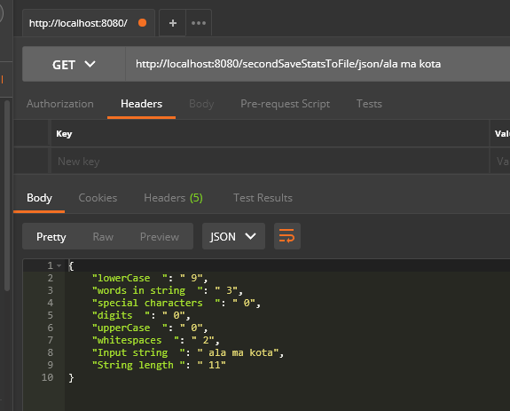
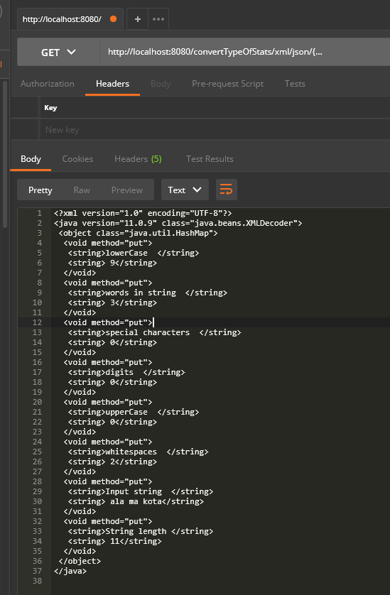

# PPKU - API konwertujące różne typy plików

Zadaniem API jest zmiana wprowadzonego pliku na plik o innym typie. Domyślnie można wprowadzić pliki: txt,json,csv i xml.
API posiada również funkcję analizowania podanej sekwencji znaków.

Aplikacja stworzona jest za pomocą Springa wykorzustując Spring Web.

Do projektu nalezy dołączyć moduły ppkwuzad3 i ppkwuzad2 z poprzednich zadań. Dodaje się je klikając
```File > Project Structure > Project Settings > Modules.```

Klikając ```+``` w drugiej kolumnie u góry dodajemy moduł

Aplikacja odpalana jest funkcją main zawartą klasie Ppkwuzad4Application. Projekt zawiera klasę ```ConvertFileTypeApi``` zawierającą endpointy ```secondSaveStatsToFile``` i ```convertTypeOfStats```.

# Analizowanie danych wejściowych

Pierwszym endpointem jest endpoint do analizowania danych wejściowych i zapisu ich na jeden z typów (txt, json, csv lub xml).

Opis:

```/secondSaveStatsToFile/{filetype}/{input}```

gdzie: 
```filetype``` to jeden z typów (txt, json, csv lub xml) ,```input``` to podany string.

Błędne dane spowodują zwrócenie wiadomości o błędzie.

Przykład:
```http://localhost:8080/secondSaveStatsToFile/json/ala ma kota ```

# Konwersja pliku
Drugim endpointem jest endpoint do konwersji wprowadzonego pliku na inny plik.

Opis:

```/convertTypeOfStats/{newfiletype}/{oldfiletype}/{input}```

gdzie:
```newfiletype``` to finalny format pliku (txt, json, csv lub xml) , ```oldfiletype```, to format inputu (txt, json, csv lub xml) , ```input``` to zawartość pliku.
Przykład:
```http://localhost:8080/convertTypeOfStats/xml/json/{"lowerCase ":" 9","words in string ":" 3","special characters ":" 0","digits ":" 0","upperCase ":" 0","whitespaces ":" 2","Input string ":" ala ma kota","String length ":" 11"}```



Błędne dane spowodują zwrócenie wiadomości o błędzie.
